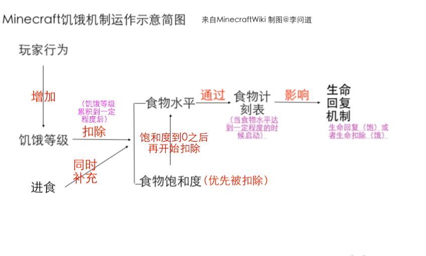

> 自从Minecraft1.9战斗更新以来，战斗机制的更改与饥饿机制的改动使玩家的生存难度有了一定提升。本文将从对饥饿机制与战斗机制的分析入手，浅谈这两大机制对生存难度影响的原理，并由此出发，列举出一些在生存过程中可以注意的一些小事项。
>
> 多年老玩家近日回坑，写点感觉已经过气的小玩意，顺便当作自己的学习笔记。
>
> 文章中所有理论皆来源于Minecraftwiki

本文将先从饥饿机制的改动切入。

在开始之前，先让我们简单介绍Minecraft**饥饿机制**的运作原理：

>  *(上图是我自己做的简图)*

饥饿机制共包括四个组成部分：食物水平、食物饱和度、食物计刻表以及饥饿等级。

其中，只有食物水平是我们能直接看到的——它就是**饥饿值**，也就是我们游戏界面中看到的”鸡腿条“。**其他的则是隐藏着的，是我们看不到的存在。**

**整个饥饿机制围绕食物水平展开。**当饥饿水平达到一定程度时，**食物计刻表**就会启动。简而言之，当食物计刻表运转一定时间后，便会对玩家的生命进行回复（当饥饿值大于18，即鸡腿大于9个）或者扣除（饥饿值等于0，即鸡腿空了）。

浅翻Wiki中“饥饿”主条目下的更新历史，不难发现，在1.9战斗更新*（Combat Update)*中，对于饥饿机制有着很大的改动。

其中，对于战斗机制的影响最大的便是*<u>”生命值的回复增加更多饥饿等级。“</u>*这一条。

