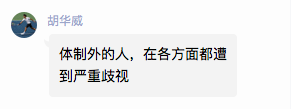
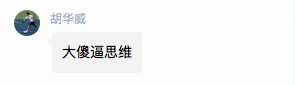
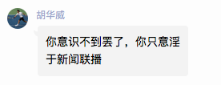
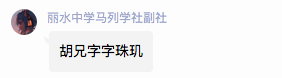
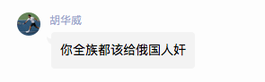

# 「哀悼胡兄，纪念带师胡华威——胡兄经典语录」

*“体制外的人，在各方面都遭到严重歧视”*——胡华威

## 傻逼四连

*“不管怎样，你就是个傻逼。”*——胡华威

## 新闻联播论

*“胡兄空前绝后，惊天地泣鬼神地创造了独属于他的'新闻联播思维论'，真的无愧带师之名。”*——评论员 李问道

“你认识不到罢了，你只意淫于新闻联播。”——胡华威

## 一语中的

”胡兄字字珠玑。“——评论员 丽水中学马列社副社

————————————————————————————

”你在洗地？“

”你全族都该给俄国人X。“

