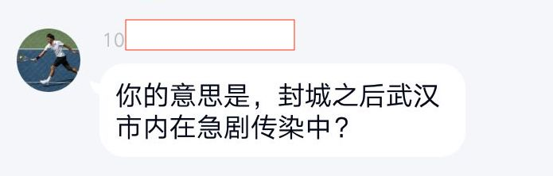
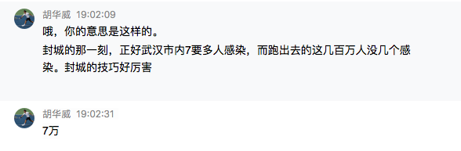

# 「哀悼胡兄，纪念带师胡华威——胡兄经典语录」

*“体制外的人，在各方面都遭到严重歧视”*——胡华威

## 导引目录：

[0 简介：一带带师胡华威](https://wendaolee.github.io/PrivateBase/Documents/proverbs/huyu.html#简介：一代带师胡华威)

1.胡兄论疫情

　　 [1.1胡兄经典理论：武汉不该封城](https://wendaolee.github.io/PrivateBase/Documents/proverbs/huyu.html#胡兄经典理论：武汉不该封城)

　　　　1.1.1武汉不该封城论总结(未编辑完)

　　　　1.1.2群友对带师“不该封城论”的攻讦（未编辑完）

　　2.0胡兄转消息：中国防疫与他国对比，中国太短期

2.胡兄悟思录

　　2.1《才明白》

　　2.2胡华威带师带你猜测今年高考题

3.胡兄散语集

　　1.2.1 傻逼四连

　　1.2.2新闻联播思维

　　1.2.3一语中的

　　1.2.4被歧视的人

　　1.2.5是你太嫩

## 简介：一代带师胡华威 

胡华威，简称胡兄。籍贯不明，年岁不明，社会人士，于2020年年初加入缙云中学马列社社群。关于他的信息我们目前知道的有：

1.成年人

2.热衷于转发营销号文章的成年人

3.热衷于转发营销号文章、有着一套超脱世俗的思想的成年人

4.热衷于转发营销号文章、有着一套超脱世俗的思想、少数在浑浊人间中保持清醒的成年人

5.热衷于转发营销号文章、有着一套超脱世俗的思想、少数在浑浊人间中保持清醒、却被政府歧视的成年人

**但是**，**尽管**我们对他了解甚少，这并不妨碍胡兄的言论给我等草民带来深切的启迪。**只可惜天妒英才，胡兄虽然深思高举，却踽踽独行于世，不被世人所理解。最后因为“精神过于伟大，小群容纳不下”不幸于2020年3月23日被踢出缙云中学马列社社群。**广大社员为了纪念胡兄在群期间给大家带来的欢乐，特地设立此页收录胡兄语录，以表广大社员拳拳钦佩之情。

## 胡兄论疫情

### 胡兄经典理论：武汉不该封城

> 该部分导读：
>
> “胡兄在阅读了介绍发达国家面对疫情采取了集体感染的科学对疫手段的文章后深有感触，发表了一番大意为'武汉不该封城'的超前理论，期间不断利用设问等手法对群员循循善诱。无奈广大群员阅历浅陋，不识胡兄之高见，对胡兄言论口诛笔伐。噫！真乃愚不可及！”——评论员 李问道
>
> “在对民主防控手段的充分了解下，在对自由人民体质的全面剖析下，胡华威带师一眼就识别出了独裁政府小题大做，杀鸡取卵式的应对疫情手段，并竭力向愚昧无知的高中生们普及社会真相，遗憾的是，顽固的马列支持者们却将其弃若敝履，呜呼，痛哉带师！”——缙中马列社18、19届社长 俞丁嘉
>
> “上联：tg封城弄巧成拙反出事
> 下联：胡兄警言明察洞里却招黑
> 横批：目田氏王” ——外地同仁

2020.3.15晚，胡兄突然发表了自己高见：

胡兄认为：因为封城的武汉死得人多，而封城前出去的那些人中死的人少，所以不封城死的人会更少，<u>因而武汉不应该封城。</u>

只可惜广大群员鼠目寸光、未能明晰胡兄思想之高深，提出了一堆质疑，认为胡兄就是在扯淡，不封城会死更多人。胡兄不愧高人，宅心仁厚，仍然心平气和地循循善诱：

无知小辈，未读懂胡兄理论中“因为封城后的武汉死的人多，而封城前从武汉出去的人死的少，所以封城会死很多人”这一核心论证便肆意攻讦:

胡兄巧用反问予人启迪：

又有无知小辈质疑：

**胡兄一代逻辑带师**，很快找出了小辈提出的质疑的漏洞：<u>既然出城几百万人里感染的很少，那么同理留在武汉的几百万人里原本感染也应该很少，但是最终武汉感染、死亡的人数多，所以武汉人大多是在封城后被感染的，正是封城导致了武汉人被大规模感染，最后死了那么多人。</u>

**因此，不应该封城！**

小辈们毕竟浅陋，再一度质疑胡兄。

胡兄脾气好，不厌其烦地利用反问开导群内诸多小辈。

还带着许些辛辣的反讽：

面对小辈们提出的隔离方面的质疑，依旧循循善诱：

对啊，外地武汉都有隔离措施，为什么武汉最后死亡人数如此之高呢？绝对是封城的错！

不愧是带师！

但是无知小辈一直闲闲间间，未能领悟带师的高深思想。带师虽是圣贤，但毕竟还是一个人，小辈如此愚笨让他实在无法继续和小辈耐心讲解。一番论战之后最终提出了自己设想的比封城更好的应对方法：

带师的level太高，小辈们实在是难以理解：

最终带师语重心长地解释，一语中的：

对啊，有病了治疗，干嘛要封城呢？

不愧是带师，达到了“大道至简”的境地，一语道破了世人看不穿的道理：

**有病了治疗不就行吗？**

**干嘛要封城呢？**

武汉这么小小一座城，医疗资源必定是有限的。只要不封城，让武汉广大同胞出去，共享其他地方的医疗资源接受治疗，不就行了吗？

不愧是带师！

可是小辈们果然和带师不在一个level上：

带师见小辈们无法开智，只得哀声叹口气，最终做出总结：

之后知道自己道之不行，不再说话，徒留小辈们自己苦恼：

呜呼！带师如此高瞻远瞩，却不为愚蠢的世人所理解，实在是天妒英才、世道荒涂，再一次恸哭带师！

### 武汉不该封城论总结

带师胡华威“武汉不该封城论”总结：

1.**武汉不该封城，封城只会让武汉同胞死得更多**

理由：因为武汉封城前走的那么多人没有死多少，而留在武汉的人死得多，因此不封城死的人会少很多。<u>故武汉不应该封城。</u>

**2.武汉大多数人是在封城后被感染的，因此不应该封城**

理由：“武汉的感染死亡人数远远大于其他地区”这一“论据”的延伸——因为出去的人感染死亡人数少，所以说原本的感染者是少的，故而是封城造成了武汉同胞留在城市内被不断感染。

**3.武汉本身医疗资源不足，只有取消封城让大家出去治疗医疗资源才能满足**

### 胡兄转消息:中国防疫与他国对比，中国实在太短期

## 胡兄悟思录

### 《才明白》

### 胡华威带师带你猜测今年高考题

## 胡兄散语集

### 傻逼四连

*“不管怎样，你就是个傻逼。”*——胡华威

### 新闻联播思维

*“胡兄空前绝后，惊天地泣鬼神地创造了独属于他的'新闻联播思维论'，真的无愧带师之名。”*——评论员 李问道

*“你认识不到罢了，你只意淫于新闻联播。”*——胡华威

### 一语中的

“胡兄字字珠玑。”——评论员 丽水中学马列学社副社

***

“你在洗地？”

“你全族都该给俄国人X。”

###被歧视的人

### 是你太嫩

